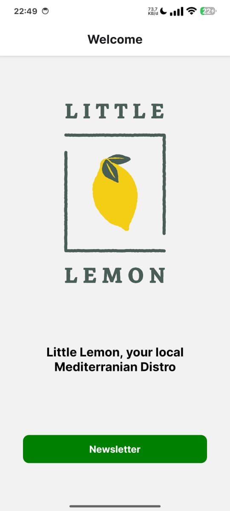
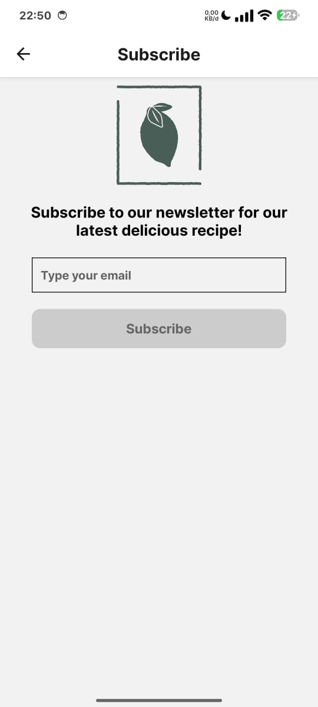
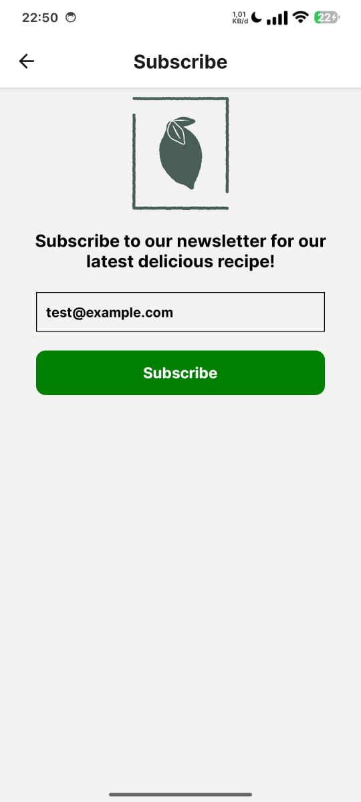
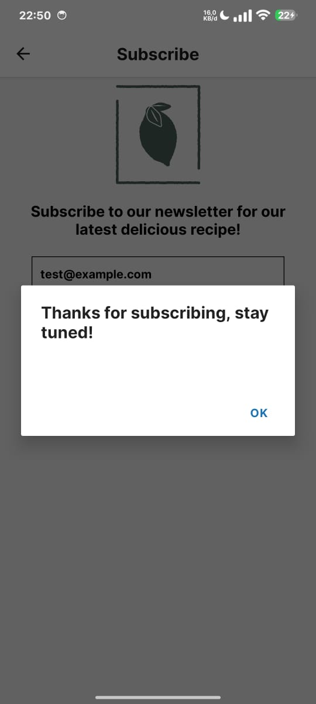

# Tugas 3 - Mobile Programming IK322
Repositori ini berisi proyek untuk Tugas 3 mata kuliah Pemrograman Mobile. Aplikasi ini dibuat menggunakan React Native dan Expo, menampilkan profil minuman Little Lemon dan laman untuk Subscribe.

  - **Nama:** Raka Iskandar
  - **NIM:** 2306068

## 📜 Deskripsi Proyek

Aplikasi mobile sederhana ini merupakan pengenalan dari minuman Little Lemon untuk mendapatkan informasi terbaru dari newsletter. Aplikasi ini terdiri dari dua layar utama yang diatur oleh Stack. Layar "Welcome" menampilkan gambar logo minuman Lemon dan button untuk berpindah ke laman "Subscribe", sementara layar "Subscribe" menampilkan input email dengan validasi dan tombol untuk subscribe newsletter.

## ✨ Fitur

Aplikasi ini memiliki beberapa fitur utama:

  - **Tampilan Profil**: Menampilkan foto logo minuman, dan button untuk berpindah laman.
  - **Tombol Interaktif**: Sebuah tombol yang ketika ditekan akan berpindah laman dan menampilkan pesan *alert*.
  - **Komponen Kustom**: Menggunakan komponen kustom seperti *CustomButton* untuk tampilan yang lebih dinamis dan mendukung state.
  - **Validasi Email untuk Subscribe**: Aplikasi ini mendukung validasi email yang valid untuk dapat menekan tombol subscribe.






## 🚀 Cara Menjalankan Proyek

Untuk menjalankan proyek ini di lingkungan pengembangan lokal Anda, ikuti langkah-langkah berikut:

1.  **Install Dependensi**
    Pastikan Anda memiliki Node.js dan npm terinstal. Buka terminal di direktori proyek dan jalankan perintah berikut untuk menginstal semua *dependency* yang diperlukan:

    ```bash
    npm install
    ```

2.  **Jalankan Aplikasi**
    Setelah instalasi selesai, jalankan perintah berikut untuk memulai server pengembangan Expo:

    ```bash
    npx expo start
    ```

3.  **Buka Aplikasi di Perangkat Anda**
    Server pengembangan akan menampilkan kode QR. Pindai kode QR tersebut menggunakan aplikasi **Expo Go** di perangkat Android atau iOS Anda untuk membuka aplikasi. Anda juga dapat menjalankannya di emulator Android atau simulator iOS.
